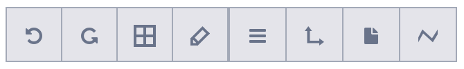
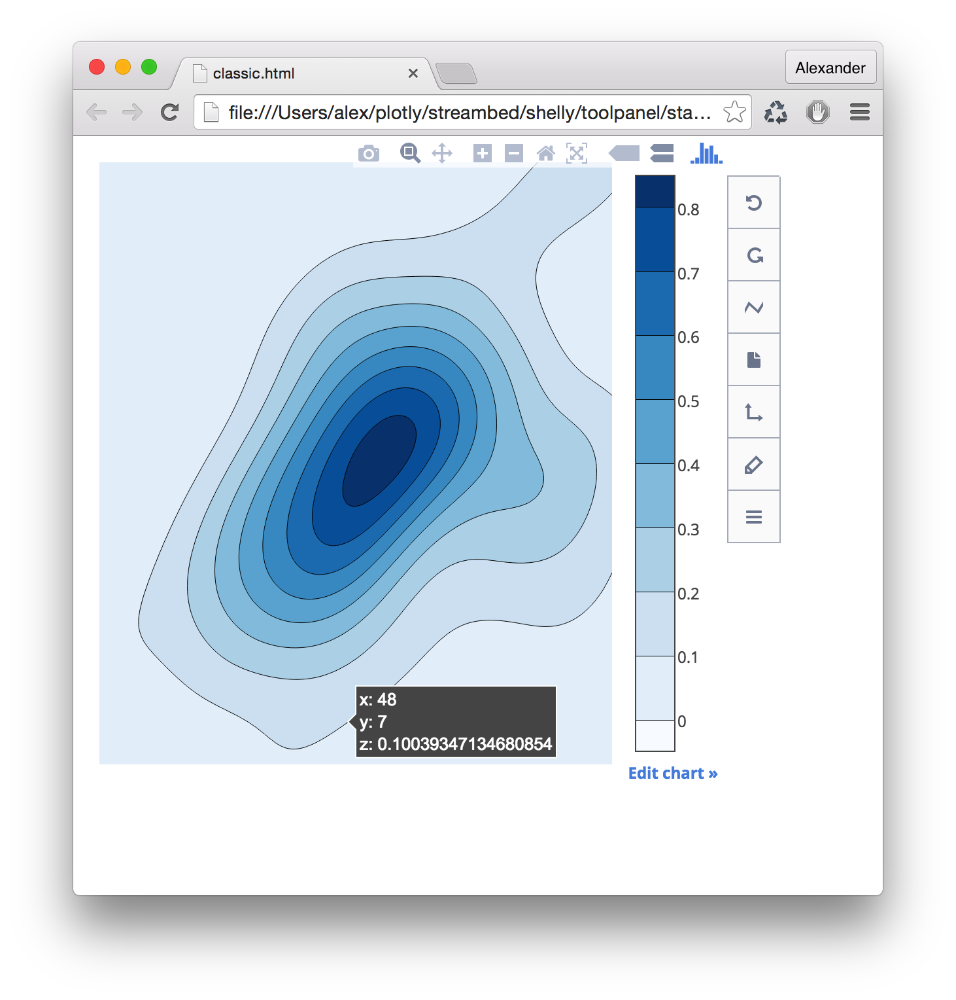

## ⚒ Plotly ToolPanel

A JavaScript package to quickly create your own customizable [Plotly.js](https://github.com/plotly/plotly.js) chart editor. 

DEMO: See the toolpanel live in Plotly's [v1 online chart maker](https://plot.ly/plotly-1) (you'll need to create a free account). 

Want help adding data visualization to your own products? [Contact us](https://plot.ly/products/consulting-and-oem/).

- [Getting Started](#getting-started)
- [API Documentation](#api-documentation)
- [Custom CSS](#custom-css)


## Getting Started

First, you'll need to download the [latest version](https://github.com/plotly/plotly.js) of Plotly.js, and the latest ToolPanel distributions.

You'll want to create an HTML file and import all of the following dependencies:

```html
<!-- ToolPanel JS dependencies Bundle -->
<script type="text/javascript" src="toolpanel-dependencies-bundle.js"></script>

<!-- PlotlyJS Bundle -->
<script type="text/javascript" src="plotly.min.js"></script>

<!-- ToolPanel Standalone JS Bundle -->
<script type="text/javascript" src="toolpanel-bundle.js"></script>

<!-- ToolPanel CSS -->
<link rel="stylesheet" type="text/css" href="build/style.css"/>
```

Once you've done that, `Plotly` and `ToolPanel` will be available for use in the global scope. Now you're ready to initialize a ToolPanel! You can see a simple example [here](dist/examples/simple/simple.js), or explore the API documentation below to see all of the available options and methods you can use.

## API Documentation
### var toolPanel = new ToolPanel(Plotly, graphDiv, opts)

- `Plotly` - Plotly.js Object (required)
- `graphDiv` - DOM element that your graph is in (required)
- `opts`
    - `standalone` - `bool` (default: `false`)
    - `slideoutDirection` - `string` - One of: (`'left'`, `'right'`, `'top'`, `'bottom'`) This determines the direction the menu will open from. (default: `'right'`)
    - `notifier` - `function` You can pass your own notifier handler `function (errMsg, duration)`
    - `orientation` - Menu Orientation, one of: `vertical` or `horizontal` (Default: `vertical`)
    - `menuStyle` - Menu Button style, one of: `descriptive` or `minimal` (Default: `descriptive`)

##### Example
```javascript

var toolPanel = new ToolPanel(Plotly, gd, {
    standalone: false,
    slideoutDirection: 'left',
    notifier: function (msg, duration) {
        Workspace.PopActions.showDialogue(msg, { duration: duration });
    },
    orientation: 'vertical',
    menuStyle: 'descriptive'
});
```

## Methods

- [`makeMenu`](#toolpanelmakemenuopts--oncomplete)
- [`createMenuButton`](#toolpanelcreatemenubuttonspec)
- [`createMenuMultiButton`](#toolpanelcreatemenumultibuttonspec-index)
- [`createMenuButtons`](#toolpanelcreatemenubuttonsspecs)
- [`getPanelButtonSpecs`](#toolpanelgetpanelbuttonspecs)
- [`style`](#toolpanelsstyle)
- [`setOrientation`](#toolpanelsetorientation)
- [`setSlideoutDirection`](#toolpanelsetslideoutdirection)
- [`getMenuItem`](#toolpanelgetmenuitemindex)
- [`renderMenu`](#toolpanelrendermenu)
- [`undo`](#toolpanelundo)
- [`redo`](#toolpanelredo)
- [`remove`](#toolpanelremove)

### toolPanel.makeMenu(opts [, onComplete])

- `opts`
    - `toolMenuContainer` (optional) - `DOM element` in which to place the toolMenu (defaults to `gd`)
    - `onComplete` (optional) - `function` callback is fired with `gd` as first parameter after menu is created.

##### Example
```javascript
var toolMenuContainer = document.getElementById('someContainer')

var toolPanelOpts = {
    toolMenuContainer: toolMenuContainer
};

toolPanel.makeMenu(toolPanelOpts, function (graphDiv) {
    // ...
});
```

### toolPanel.createMenuButton(spec)
Create a Menu Button and append it to the ToolMenu.

##### `spec`
```javascript
{
    iconClass: 'string', // Icon class to use for button icon.
    labelContent: 'string', // Text content for label or tooltip
    handler: 'function', // Handler function to call when button is triggered.
    eventName: 'string', // Name of event to trigger handler (default: 'click')
    buttonClass: 'string' // Optional css class to append to the button's DOM element.
    horizontalFloat: 'string', // optional, will float the buttons either `'right'` or `'left'` when the `menuStyle` is `horizontal-grey`.
    index: 'number' // optional, the index of toolPanel.toolMenuItems in which to insert the menuItem.
}
```

##### Example
```javascript
toolPanel.createMenuButton({
    eventName: 'click',
    handler: function () {
        triggerAnalysis()
    },
    iconClass: 'icon-code',
    labelContent: 'Analyze',
    horizontalFloat: 'right',
    index: 3
});
```

##### `descriptive` menu style


##### `minimal` menu style (multiple buttons)


##### `minimal` menu style, `horizontal` orientation (multiple buttons)


### toolPanel.createMenuButtons(specs)
A helper method for `createMenuButton`. Pass in an `Array` of `{buttonSpecs}` and it will create and append them all to the ToolMenu.

### toolPanel.getPanelButtonSpecs()
Returns an `Array` of `{buttonSpecs}` for the default Graph Edit buttons that open associated panels. You can pass this array to `toolPanel.createMenuButtons` to create the DOM elements.

This list includes:
- Traces
- Layout
- Axes
- Notes
- Legend

##### Example
```javascript
var buttonSpecs = toolPanel.getPanelButtonSpecs();
toolPanel.createMenuButtons(buttonSpecs);
```

##### `descriptive menu style`


#### `minimal menu style`


### toolPanel.createMenuMultiButton(spec, index)
Create a MultiButton and append it to the ToolMenu

- `spec` Array of mini button specs.
- `index` Number: (optional) the index of toolPanel.toolMenuItems in which to insert the menuItem.

##### `spec`
```javascript
[{
    iconClass: 'string',
    labelContent: 'string',
    eventName: 'string',
    handler: 'function',
    buttonClass: 'string'
}...]
```

##### Example
```javascript
toolPanel.createMenuMultiButton([
    {
        labelContent: 'Copy',
        iconClass: 'icon-copy',
        handler: function () {}
    },
    {
        labelContent: 'download',
        iconClass: 'icon-download',
        handler: function () {}
    },
    {
        labelContent: 'Code',
        iconClass: 'icon-code',
        handler: function () {}
    }
], 5);
```

##### `descriptive` menu style
This will create a button group that automatically sizes itself to the number of inner buttons.


##### `minimal` menu styles
Button group will still be created, however each button will be made into its own element. You can toggle back and forth between `descriptive` and `minimal` views and the toolPanel will automatically handle the style and line-breaks.


### toolPanel.createMenuSpacer()
Creates an inserts a spacer the size of one `menuButton`. Spacer is then added to the `toolMenu.toolMenuItems` array.


### toolPanel.style(menuStyle)
A method that sets the menu layout style and re-renders the menu with that style. Returns `toolPanel` so you can chain styling and orientation calls together.

- `style` One of:
    - `descriptive`
    - `minimal`

### toolPanel.setOrientation(orientation)
A method that sets the orientation of the toolMenu, and re-renders it. Returns `toolPanel` so you can chain styling and orientation calls together.

- `orientation` One of:
    - `vertical`
    - `horizontal`

See below for examples of the different menu styles.

### toolPanel.setSlideoutDirection(direction)
A method that sets the direction that the `slideoutContainer` opens up to. Returns `toolPanel` so you can chain calls together.

- `direction` One of:
    - `right`
    - `left`
    - `top`
    - `bottom`

#### Style `descriptive`, Orientation `vertical`


#### Style `minimal`, Orientation `vertical`


#### Style `minimal`, Orientation `horizontal`


### toolPanel.getMenuItem(index)
Returns the `menuItem` at `index`. `menuItem` is the DOM element of the menuItem, with an attached `remove` method, which removes it from the DOM, as well as from the `toolPanel.toolMenuItems` array.

##### Example
```
var undoRedoButton = toolPanel.getMenuItem(0);
undoRedoButton.remove()
```

### toolPanel.renderMenu()
Internal method called automatically after adding/removing a `menuItem`, or after `style` or `setOrientation` are invoked. Will cause the menu to render all of the items in in `toolPanel.toolMenuItems` array.

### toolPanel.undo()
Undo's the last operation that the toolPanel executed on the graph. You can supply this method to a button handler to create an `undo` button.

### toolPanel.redo()
Redoes the last operation that the toolPanel executed on the graph. You can supply this method to a button handler to create an `redo` button.

### toolPanel.remove()
Will remove the toolPanel instance and destroy any popovers.

## Custom CSS
Should you wish to override the styles of the buttons, these are the relevant CSS className you would want to overwrite:

- `.toolmenu` - The main className for the menu wrapper element
- `.toolmenu-button-row` - Button container className for single or multi buttons.
- `.toolmenu-button` - Regular sized button className.
    - `.--minimal` - Modifier when the toolmenu style is `minimal`.
    - `.--mini` - Modifier for mini button group item styles
    - `.--is-active` - Active state modifier className
    - `.--horizontal` - Modifier for when toolmenu orientation is `horiztonal`.
- `.toolmenu-spacer` className for spacer elements
    - `.--horizontal` - Modifier for when the toolmenu orientation is `horizontal`.

## Examples
See [examples](dist/examples/)
